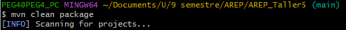
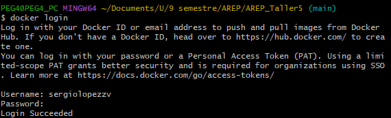

### Sergio Daniel Lopez Vargas
# AREP_Taller5

## Introducción:

El código proporcionado implementa un servidor web utilizando SparkJava, un microframework web para Java, que permite crear aplicaciones web de manera sencilla y rápida.

## Características y Funcionalidades:

### Rutas estáticas y dinámicas:
* Define rutas estáticas utilizando staticFileLocation("/public"), lo que permite servir 
archivos estáticos desde el directorio /public.
* Define rutas dinámicas para operaciones matemáticas (/coseno, /seno, /magnitud) y para 
verificar si una cadena es un palíndromo (/palindromo).
* Utiliza el método get() para manejar solicitudes HTTP GET en las diferentes rutas, 
respondiendo con HTML correspondiente a cada operación.

### Operaciones matemáticas:
* Las operaciones de seno, coseno y magnitud se realizan mediante llamadas AJAX utilizando 
JavaScript.
* Los resultados de las operaciones se muestran dinámicamente en la página web sin necesidad 
de recargarla.
* Las operaciones se realizan en el servidor y se devuelven al cliente como respuesta a 
las solicitudes.

### Verificación de palíndromos:
* Permite al usuario ingresar una cadena y verifica si es un palíndromo o no.
* Al igual que las operaciones matemáticas, la verificación se realiza en el servidor y 
se muestra el resultado dinámicamente en la página web.

## Arquitectura

### Cliente (Frontend):
* La interfaz de usuario se compone de páginas HTML y scripts JavaScript que permiten al usuario interactuar con el servidor web.
* Utiliza tecnologías como AJAX para enviar solicitudes asíncronas al servidor y actualizar dinámicamente el contenido de la página sin necesidad de recargarla.
* Los archivos HTML y JavaScript pueden ser servidos desde el mismo servidor web o desde un servidor web estático separado, dependiendo de los requisitos de la aplicación.

### Servidor (Backend):
* Implementado con SparkJava, un microframework web para Java que permite crear aplicaciones web de manera sencilla y rápida.
* El servidor SparkJava maneja las solicitudes HTTP entrantes y las enruta a las correspondientes operaciones matemáticas o de verificación de palíndromos.
* Utiliza un conjunto de rutas definidas para cada operación matemática (coseno, seno, magnitud) y para verificar si una cadena es un palíndromo.
* Las operaciones matemáticas y la verificación de palíndromos se realizan en el servidor y las respuestas se devuelven al cliente en formato HTML dinámico.

### Contenedores Docker:
* El servidor web implementado con SparkJava se empaqueta en un contenedor de Docker para su fácil distribución y ejecución en cualquier entorno compatible con Docker.
* Cada operación matemática y la verificación de palíndromos pueden encapsularse en contenedores separados para modularidad y escalabilidad.
* Se utiliza un Dockerfile para definir cómo construir las imágenes de contenedor del servidor SparkJava y de las operaciones matemáticas y de verificación de palíndromos.
* Las imágenes de contenedor se pueden construir localmente y luego enviar a Docker Hub para su almacenamiento y distribución, o pueden descargarse directamente desde Docker Hub para su ejecución en entornos de producción o en la nube.

### Ciclo de Desarrollo y Despliegue:
* Durante el desarrollo local, los cambios en el código pueden probarse fácilmente utilizando contenedores locales antes de subir las imágenes a Docker Hub.
* Las imágenes de contenedor se pueden construir y ejecutar localmente para realizar pruebas de integración y depuración.
* Una vez que las imágenes de contenedor están listas y probadas localmente, pueden enviarse a Docker Hub para su implementación en la nube.
* Las imágenes pueden desplegarse en cualquier entorno compatible con Docker, como Kubernetes, AWS, Azure, Google Cloud, etc.

## Instrucciones de Ejecución
Abra Docker realice los siguientes comandos:
* Verificar que no hayan instancias ya creadas:

```
docker images
```


* Hacer pull para descargar la imagen del repositorio

```
docker pull sergiolopezzv/taller5:latest
```


* Crear contendor del la imagen descargada

```
docker run -d -p 34000:46000 --name firstdockercontainer sergiolopezzv/taller5
```

* Verificar en docker que se este corriendo correctamente


Ya puedes acceder a http://localhost:34000* y verificar el funcionamiento del servidor

### Pruebas
* Se realizó la petición a http://localhost:34000 (Se puede ver como accede a todas los archivos de forma estatica)


* Se realizó la petición a http://localhost:34000/seno (Se puede observar como esta funcionando correctamente la operacion seno)


* Se realizó la petición a http://localhost:34000/coseno (Se puede observar como esta funcionando correctamente la operacion coseno)


* Se realizó la petición a http://localhost:34000/palindromo (Se puede observar como esta funcionando correctamente la verificacion de palindromo)


* Se realizó la petición a http://localhost:34000/magnitud (Se puede observar como esta funcionando correctamente la operacion del vector)


## Creacion de imagenes locales 
* Compilar proyecto




* Crear contenedor del servidor


* Crear imagen del servidor


Aqui ya puedes acceder localmente a http://localhost:34000*

## Creacion de imagen web con Docker hub

* Construye imagen en el respectivo repositorio


* Hacer login al repositorio anterior



* Subir la imgen con el servidor terminado (push)


Ya estará disponible para poder hacerle pull y abrir el servidor desde cualquier PC

